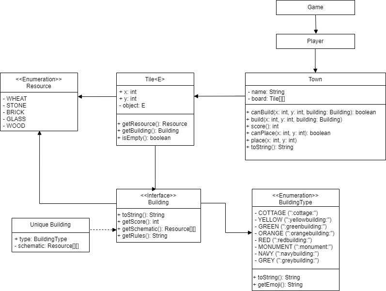
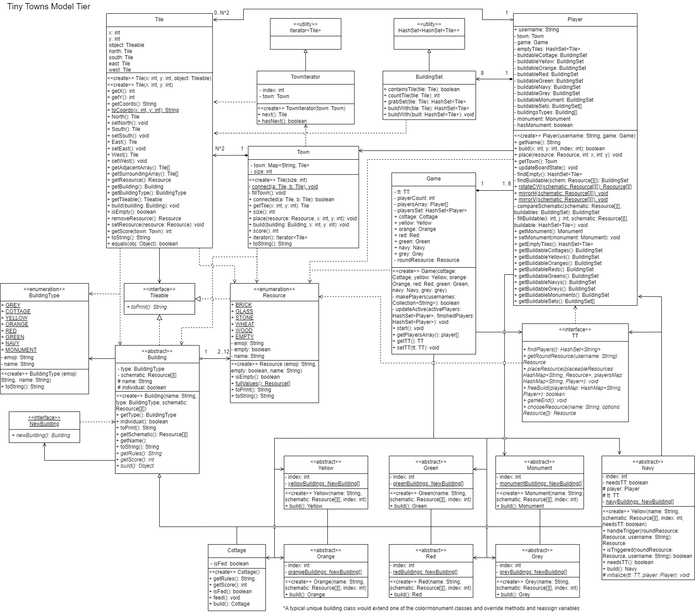

# Tiny Towns API Design Project Documentation

## Summary

This API intends to create a version of the board game "Tiny Towns" with the Java language. While learning principles of object oriented programming, I became intrigued, and wanted to practice on a design of my own. Here is a short video on how to play the game: 

[Video here](https://www.youtube.com/watch?v=yF--uYWp0zw)

### Initial Purpose and Plans

The initial purpose of this API was to be used with a discord bot built with the JDA. [(Java Discord API)](https://jda.wiki/introduction/jda/) This way me and my friends could play the game while away on summer break. While this project started as a group effort, you may be able to tell from the commit history that it quickly became a solo mission.

While working with the JDA, it became clear to me that it might not have been the best option for the front-end. After grappling with it for longer than I should have, I decided I would come back to the project at a later date with plans to implement a front-end with a proper GUI. 

### Process

When the project started, I wasn't sure how complex things would end up being. I made this UML diagram as a rough starting point:

After working with the API for months on and off, it developed a much more complex class system. In order to visualize this, I sat down and made this diagram to represent it all:

