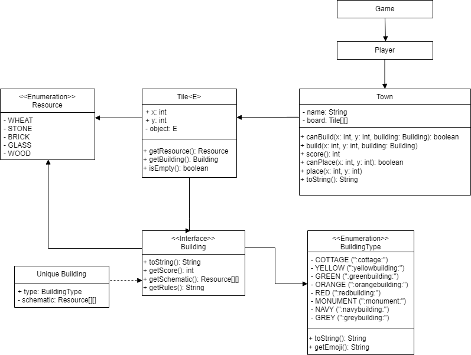
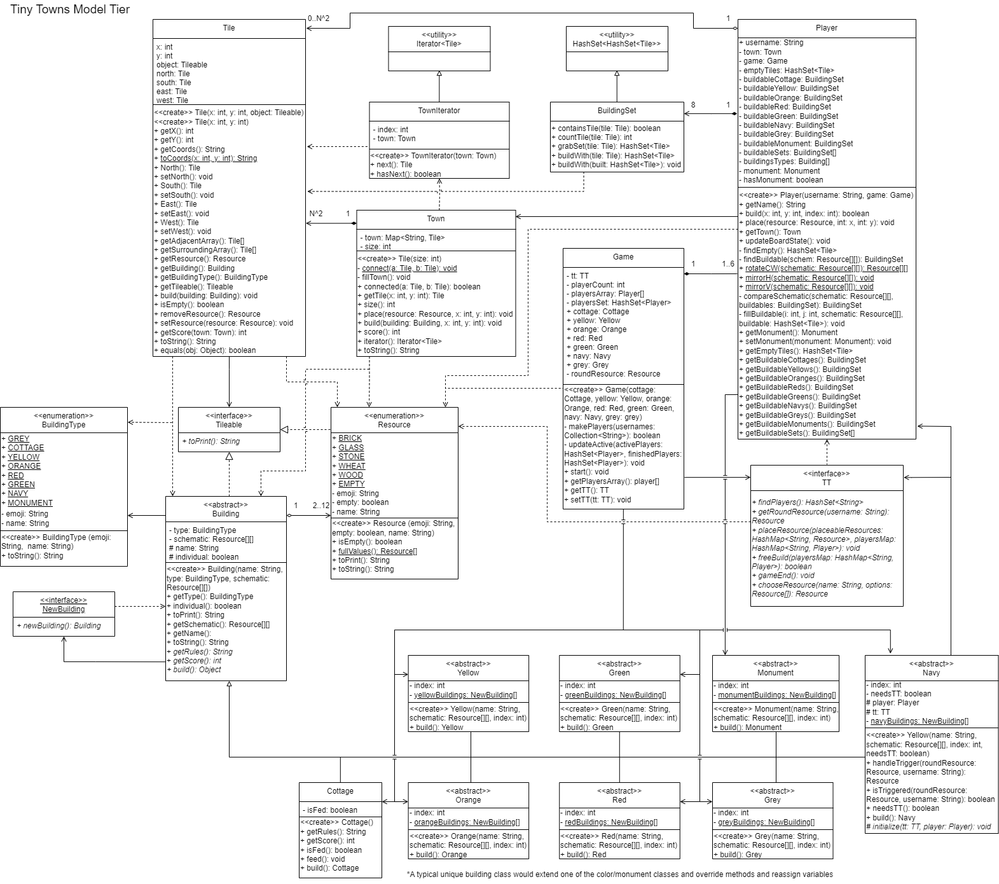

# Tiny Towns API Design Project Documentation

## Summary

This API intends to create a version of the board game "Tiny Towns" with the Java language. While learning principles of object oriented programming, I became intrigued, and wanted to practice on a design of my own. Here is a short video on how to play the game: 

[Video here](https://www.youtube.com/watch?v=yF--uYWp0zw)

### Initial Purpose and Plans

The initial purpose of this API was to be used with a discord bot built with the JDA. [(Java Discord API)](https://jda.wiki/introduction/jda/) This way me and my friends could play the game while away on summer break. While this project started as a group effort, you may be able to tell from the commit history that it quickly became a solo mission.

While working with the JDA, it became clear to me that it might not have been the best option for the front-end. After grappling with it for longer than I should have, I decided I would come back to the project at a later date with plans to implement a front-end with a proper GUI. 

### Process

When the project started, I wasn't sure how complex things would end up being. I made this UML diagram as a rough starting point:

After working with the API for months on and off, it developed a much more complex class system. In order to visualize this, I sat down and made this diagram to represent it all:

### Explanation

The API is designed to be implemented RESTfully, right now just passing Java objects back to the TT class. The functions in the TT class currently represent all of the endpoints that would need to exist in some sort of controller. The interactiosn from this class are relatively simple, but things definitely get more complex deeper into the objects. 

On the low end, once you start looking at the dependencies of classes like Town or Building, things can get a bit more jumbled. While I believe the dependencies are reasonable, and definitely following the Single Responsibility Principle, there is no doubt that the UML diagram is a bit confusing. 

On the bottom and the left we have classes like Tile, Building, Resource, and the collection of building classifications. These classes are all direct implementations of objects within the game and attempts to mimmic their behavior to the best of my ability. On the top right, there are classes thet are neccesary for a proper and efficient implementation. This includes the BuildingSet class, as well as Player and Game. Some of the building type classes, namely Monument and Navy, depend on game classes because their effects will most likely always require a scope as big as the whole game. 

Following aggregates is a good way to look at this diagram. You can see that the game aggregates players, towns aggregate tiles, and buildings aggregate resources, al of which are intuitive interactions.

### Solutions

There are a handful od classes in this diagram that you wouldn't intuitively assume from knowing how to play Tine Towns. The first and probably the simplest one would be the Tileable interface. This interface is a product of Java's strict type casting rules, and just allows for both buildings and resources to be held by a tile. Another simple example would be the TownIterator. This class just allows me to easily iterate through each of the tiles aggregated in a town, especially in order.

Another result of Java's weird rules is the NewBuilding interface. This interface has only one function, and the interface's purpose is to be implemented by anonymouse classes used essentially as a factory. The NewBuilding class is initialized by each of the building type classes, and depending on which unique building is being played with in a given game the NewBuilding class will simply be used to generate new instances of that building. (The generated building having been cast as a class of its building type.)

Finally we have the BuildingSet class. This class is an implementation of a a Java HashSet. Not only that, it is hard coded to always hold values of other HashsSets of tiles. (Hence the HashSet<HashSet<Tile>> utility class being featured.) Its purpose is to hold every set of tiles where a building couled be built. After a player has placed a resource, an algorithm runs that compares every building schematic for that game against the players board, finding sets of tiles where that building could be legally placed. Each set of tiles is placed in a set of set of tiles for each building type. Since the algorithm runs only when neccesary, it results in a much quicker run time, and allows for the code to instantly know where any building can legally be built.
